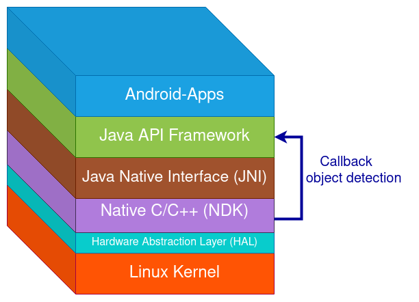
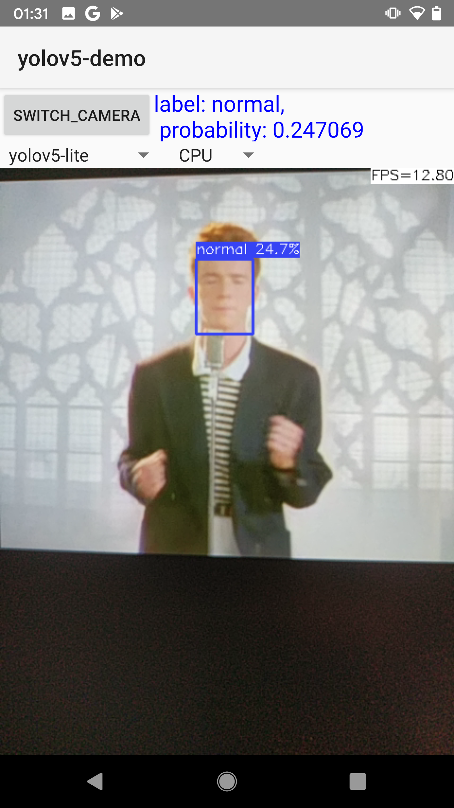

# Disclaimer
Credit for this project should go to: https://github.com/nihui. I merely made some slight adjustments.
# What's new
This repository implements a callback from the C++ Layer to the Android Layer using JNI (java native interface).  
This essentially means you can access the results (label and probability) of the object detection comfortably from the Java Layer, like shown in the following diagram:

✔️  Get detected Object's information (Label, Position and Bounding Box)


In code, this boils down to a callback method in `MainActivity`. This method is called by the native (C/C++) Layer. (This happens several times per second) 
```Java
    public void callback(String output, String probability, String x, String y, String width, String height) {
        runOnUiThread(new Runnable() {
            @Override
            public void run() {
                binding.textViewCurrentLabel.setText(String.format("label: %s, \nprobability: %s, Rect: [x: %s, y: %s, width: %s, height: %s ]",
                        output, probability, x, y, width, height));
            }
        });
    }
```
# Demo

# ncnn-android-yolo5
This is a sample ncnn android project, it depends on ncnn library and opencv

https://github.com/Tencent/ncnn

https://github.com/nihui/opencv-mobile


## how to build and run
### step1
https://github.com/Tencent/ncnn/releases

* Download ncnn-YYYYMMDD-android-vulkan.zip or build ncnn for android yourself
* Extract ncnn-YYYYMMDD-android-vulkan.zip into **app/src/main/jni** and change the **ncnn_DIR** path to yours in **app/src/main/jni/CMakeLists.txt**

### step2
https://github.com/nihui/opencv-mobile

* Download opencv-mobile-XYZ-android.zip
* Extract opencv-mobile-XYZ-android.zip into **app/src/main/jni** and change the **OpenCV_DIR** path to yours in **app/src/main/jni/CMakeLists.txt**

